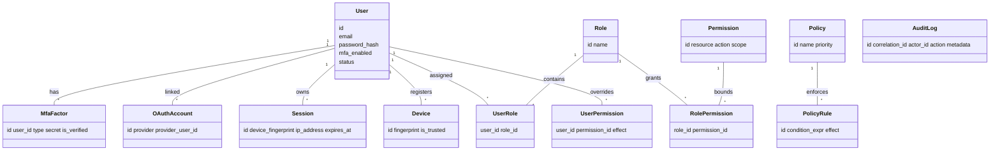

# Data Class Diagram (High Level)

```mermaid
classDiagram
  class User {
    id
    email
    password_hash
    mfa_enabled
    status
  }
  class MfaFactor { id user_id type secret is_verified }
  class OAuthAccount { id provider provider_user_id }
  class Role { id name }
  class Permission { id resource action scope }
  class UserRole { user_id role_id }
  class RolePermission { role_id permission_id }
  class UserPermission { user_id permission_id effect }
  class Policy { id name priority }
  class PolicyRule { id condition_expr effect }
  class Session { id device_fingerprint ip_address expires_at }
  class Device { id fingerprint is_trusted }
  class AuditLog { id correlation_id actor_id action metadata }

  User "1" -- "*" MfaFactor : has
  User "1" -- "*" OAuthAccount : linked
  User "1" -- "*" Session : owns
  User "1" -- "*" Device : registers
  User "1" -- "*" UserRole : assigned
  Role "1" -- "*" UserRole : contains
  Role "1" -- "*" RolePermission : grants
  Permission "1" -- "*" RolePermission : bounds
  User "1" -- "*" UserPermission : overrides
  Policy "1" -- "*" PolicyRule : enforces
```
