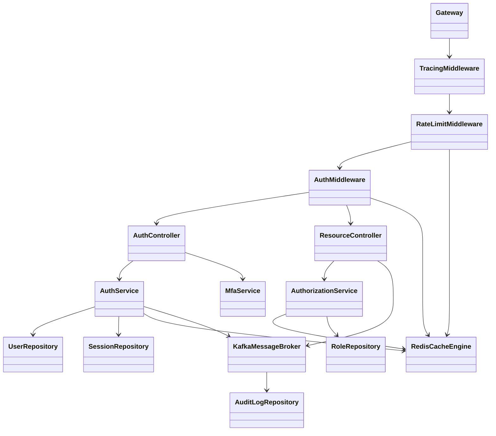

# Enterprise Architecture Diagram (Middleware, Cache, Broker)

```mermaid
classDiagram
  class Gateway
  class TracingMiddleware
  class RateLimitMiddleware
  class AuthMiddleware

  class AuthController
  class ResourceController

  class AuthService
  class AuthorizationService
  class MfaService

  class RedisCacheEngine
  class KafkaMessageBroker

  class UserRepository
  class RoleRepository
  class SessionRepository
  class AuditLogRepository

  Gateway --> TracingMiddleware
  TracingMiddleware --> RateLimitMiddleware
  RateLimitMiddleware --> AuthMiddleware
  AuthMiddleware --> AuthController
  AuthMiddleware --> ResourceController

  AuthMiddleware --> RedisCacheEngine
  RateLimitMiddleware --> RedisCacheEngine

  AuthController --> AuthService
  AuthController --> MfaService
  ResourceController --> AuthorizationService

  AuthService --> UserRepository
  AuthService --> SessionRepository
  AuthService --> RedisCacheEngine

  AuthorizationService --> RedisCacheEngine
  AuthorizationService --> RoleRepository

  AuthService --> KafkaMessageBroker
  ResourceController --> KafkaMessageBroker

  KafkaMessageBroker --> AuditLogRepository
```
